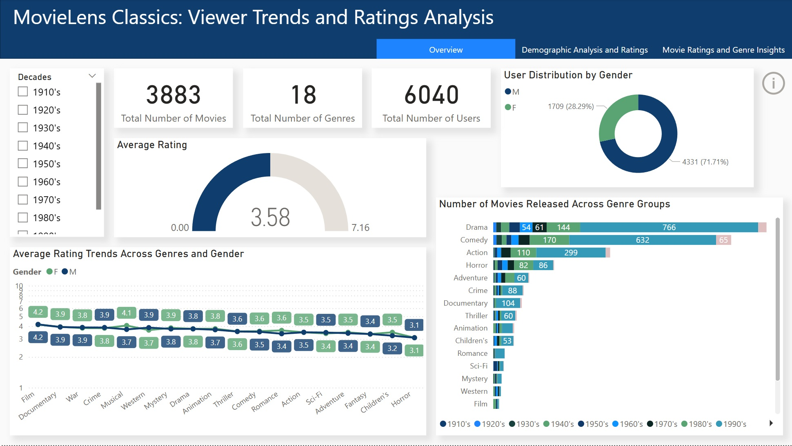
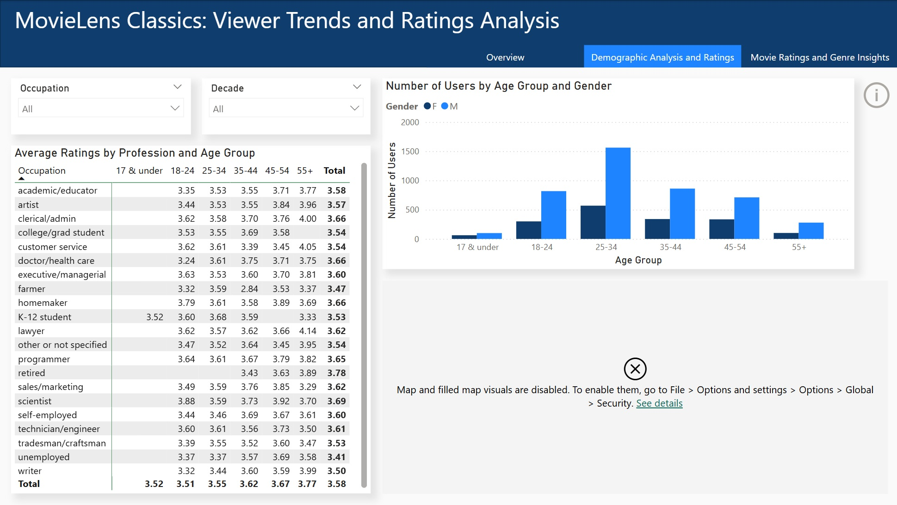
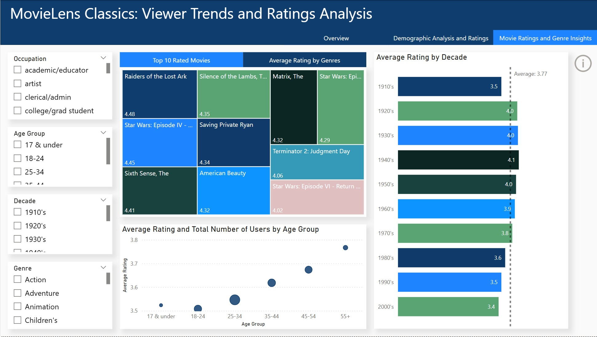
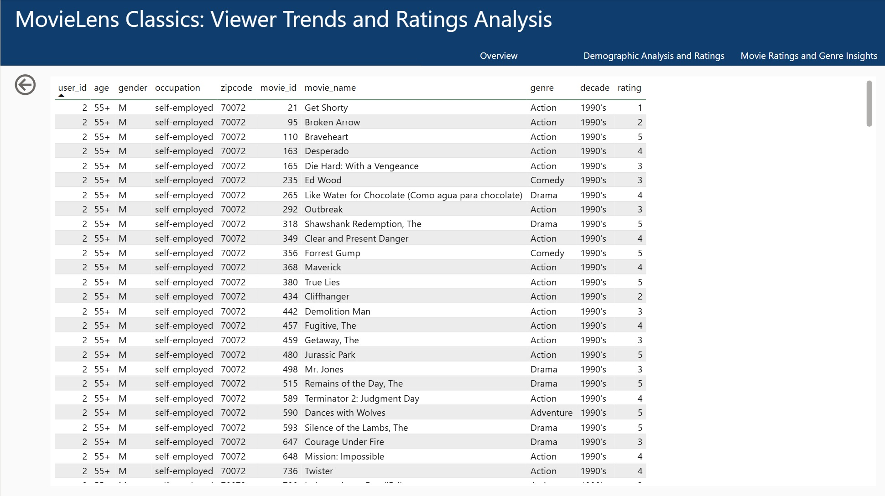

# Power BI Dashboard: MovieLens Classic Movie Analysis

> Analyzing classic movies (pre-2000) using Power BI and MovieLens dataset.

---

## **Project Overview**
This Power BI project analyzes **classic movies released before 2000** using the **MovieLens dataset**.
The dashboard explores:
- **Genre diversity**
- **User demographics**
- **Movie ratings and engagement patterns**
- **Age- and occupation-based viewing habits**

- This project showcases **interactive visualizations, slicers, and DAX calculations** to uncover insights.

---

## **Dashboard Previews**

### **1. Overview Dashboard**
- Shows total **movies released, genres, and users**.
- **Key visuals:** KPI Cards, Gauge Chart, Donut Chart, Area Chart, Stacked Bar Chart, and a Slicer.

### **2. Demographic Analysis & Ratings**
- Breakdown of **users by age group and gender**.
- Ratings by **profession and occupation**.
- **Key visuals:** Matrix Table, Clustered Column Chart, Map, and Slicers.

### **3. Movie Ratings & Genre Insights**
- **Top-rated movies & genres**.
- Average movie ratings **by decade**.
- **Key visuals:** Treemap, Clustered Bar Chart, Scatterplot, and Slicers.

### **4. Raw Data Table (User, Movie, Ratings)**
- **Filtered data table for exploration**.

---

## **Dataset Used**
### **1. rating.csv** (User ratings for movies)
| Column Name | Description |
|-------------|------------|
| `user_id` | Unique ID assigned to each user |
| `movie_id` | Unique ID assigned to each movie |
| `rating` | Rating given by the user (scale 1-5) |
| `timestamp` | Time of rating |

### **2. movie.csv** (Movie details)
| Column Name | Description |
|-------------|------------|
| `movie_id` | Unique ID assigned to each movie |
| `movie_name` | Movie title |
| `genre` | Genre(s) of the movie (multiple genres separated by pipe `|`) |
| `year` | Release year of the movie |

### **3. user.csv** (User demographic data)
| Column Name | Description |
|-------------|------------|
| `user_id` | Unique ID assigned to each user |
| `age` | Age of the user |
| `gender` | Gender (`M` for Male, `F` for Female) |
| `occupation` | User's occupation |
| `zipcode` | Zip code of user's residence |

---

